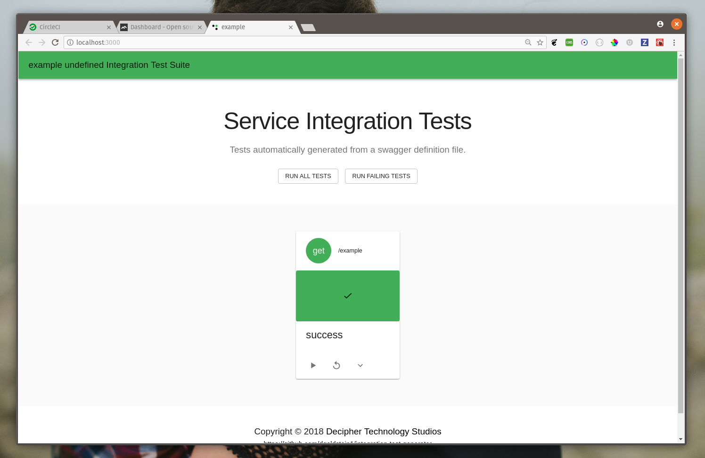

# Integration Test Generator UI

User interface for displaying swagger integration tests running.

[](https://codeclimate.com/github/dgoldstein1/swagger-integration-test-UI/test_coverage)



## Planned Features

- running tests with CLI

## Development

### Prerequisites

You will need

- [Node JS](https://nodejs.org/en/)

### Installing

```sh
git clone git@github.com:dgoldstein1/swagger-integration-test-UI.git
cd swagger-integration-test-UI
npm install
npm start
```

## Authors

- **David Goldstein** - [DavidCharlesGoldstein.com](http://www.davidcharlesgoldstein.com/?github-swagger-integration-test-UI) - [Decipher Technology Studios](http://deciphernow.com/)

See also the list of [contributors](https://github.com/your/project/contributors) who participated in this project.

## License

This project is licensed under the Apache License - see the [license.md](LICENSE) file for details
